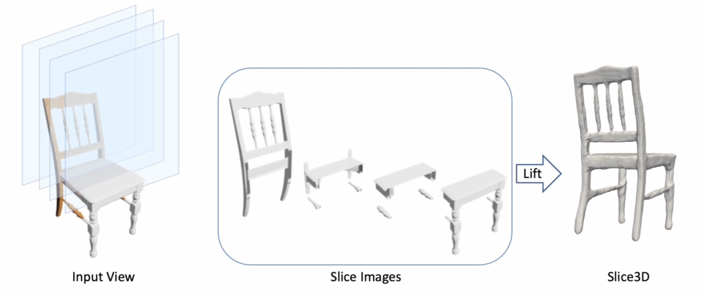

# Slice3D

This is the official Pytorch implementation of the paper:

Slice3D: Multi-Slice, Occlusion-Revealing, Single View 3D Reconstruction. CVPR. 2024.

Yizhi Wang, Wallace Lira, Wenqi Wang, Ali Mahdavi-Amiri, Hao Zhang.

Paper: [arxiv](https://arxiv.org/abs/2312.02221)
Homepage: [Slice3D](https://yizhiwang96.github.io/Slice3D/)
Video: [Youtube](https://www.youtube.com/watch?v=4MDAiFWdXRw&ab_channel=YizhiWang)



## Setup

To setup a conda environment, and build dependencies:
```
# create conda environment for Slice3D
conda create -n slice3d python=3.9
conda activate slice3d
# install Pytorch 1.13.1 and CUDA 11.7, more details in https://pytorch.org/get-started/previous-versions/#v1131
conda install pytorch==1.13.1 torchvision==0.14.1 torchaudio==0.13.1 pytorch-cuda=11.7 -c pytorch -c nvidia
pip install trimesh open3d tensorboard Cython opencv-python h5py

# install tools from [ConvONet](https://pengsongyou.github.io/conv_onet)
cd reg_slices
python setup.py build_ext --inplace
```

## Dataset

The dataset (~180GB) used in our experiments can be found in [OneDrive](https://1drv.ms/f/s!AkDQSKsmQQCghq1jUC2J0nowH4XeOQ?e=0ceeg9) or [阿里云盘](to be updated).

It contains Objaverse Dataset (ShapeNet will be added soon).

The layout of ``data`` dir is: 

```
data
├── objaverse
    ├── 00_img_input
    ├── 01_img_slices
    ├── 02_sdfs  
    ├── 03_splits
    ├── input_models_path-lvis.json
```

For SDF calculation, we followed [this script](https://github.com/Xharlie/DISN/blob/master/preprocessing/create_point_sdf_grid.py). We normalized all the 3D objects by resizing the body diagnoal to 1.

## Pretrained Checkpoints

All the pretrained checkpoints can be found in [OneDrive](https://1drv.ms/f/s!AkDQSKsmQQCghq1jUC2J0nowH4XeOQ?e=0ceeg9) or [阿里云盘](to be updated). Specifically, they are
```
reg_slices
├── experiments
│    ├── 2024_0419_objaverse_regression_pretrained
│    │   ├── ckpt
│    ├── 2024_0419_objaverse_gt_to_3d_pretrained
│    │   ├── ckpt
gen_slices
├── logs
│    ├── 2024-04-23T02-11-33_objaverse-ldm-kl-8
│    │   ├── checkpoints
```
More details about these checkpoints can be found below.

## Render Slice Images
First download Objaverse lvis dataset, whose ids can be found in `data/objaverse/input_models_path-lvis.json`. In `gen_input.py` and `gen_slices.py`, change `path_root_objaverse` and `path_blender` accordingly. 
```
cd render_slices
python gen_input.py
```
`gen_input.py` will render object images and record the camera poses in `meta.pkl`.
Then, run
```
python gen_slices.py
```
`gen_slices.py` will slice the objects and render the slices according to the above camera poses. The default slicing direction is camera-aligned. You can change it by changing `--slice_direction camera` to `--slice_direction axis` to slice along the default axis of an object. But it is not suitable for Objaverse 3D models since they feature random rotations. For datasets like ShapeNet where 3D models are in canonical poses, we can use `--slice_direction axis`

## Training

### Regression-based Slicing

```
cd reg_slices
CUDA_VISIBLE_DEVICES=0 python train.py --name_exp 2024_0419_objaverse_regression --name_dataset objaverse
```
To resume a training, add `--resume`.

Test pretrained checkpoint:
```
CUDA_VISIBLE_DEVICES=0 python reconstruct.py --name_exp 2024_0419_objaverse_regression_pretrained --name_ckpt 112_146222_0.01299_0.843_0.0132.ckpt --name_dataset objaverse --mode test
```
which will produce 3D meshes in `experiments/{name_exp}/results/{name_dataset}`.

### Generation-based Slicing

#### Training Slice Image Generation Model

The training is based on [Latent Diffusion](https://github.com/CompVis/latent-diffusion). First build an indepedent [Latent Diffusion environment](https://github.com/CompVis/latent-diffusion?tab=readme-ov-file#requirements) named `ldm`. Then download the pretrained [image-autocoder model (kl-f8)](https://ommer-lab.com/files/latent-diffusion/kl-f8.zip) to `gen_slices/logs/autoencoder_kl_f8/checkpoints/`.
```
cd gen_slices
conda activate ldm
python main.py --base configs/latent-diffusion/objaverse-ldm-kl-8.yaml -t --gpus 0,
```

To resume a training, add `--resume_from_checkpoint {path_to_latest_ckpt}`. Note that the code currently does not work for multi-gpu training and we are looking into this issue.

Test pretrained checkpoint:
```
python main.py --base configs/latent-diffusion/objaverse-ldm-kl-8-infer.yaml --gpus 0,
```
which will save the generated slice images to `{ckpt_path}/images_testing_sampled`.


#### Generated Slice Images to 3D
First, we organize the generated slice images according to the layout of `data`. In `gen_slices`, run:
```
python re_org_slices.py --name_dataset objaverse
```
then, we employ the trained GT-Slice-Images-to-3D model to reconstruct from these generated images:

```
CUDA_VISIBLE_DEVICES=0 python reconstruct.py --name_exp 2024_0419_objaverse_gt_to_3d_pretrained --name_dataset objaverse --name_ckpt 116_208728_0.007433_0.9034.ckpt --name_model gtslice --from_which_slices gen
```

We have provided a pretrained GT-Slice-Images-to-3D model in `reg_slices/experiments/2024_0419_objaverse_gt_to_3d/ckpt`, if you want to train it by yourself:

#### Training GT Slice Images to 3D 
Note that we train the model on Latent Diffusion's reconstructed GT slice images. To obtain these reconstructed GT slice images, run

```
cd gen_slices
python main.py --base configs/autoencoder/autoencoder_kl_f8_infer.yaml --gpus 0,
```

Then we organize the reconstructed slice images:
```
python re_org_slices.py --name_dataset objaverse --type_slices rec --dir_slices logs/autoencoder_kl_f8/images_reconstructed
```
Last, train the GT-Slice-Images-to-3D model:
```
cd reg_slices
CUDA_VISIBLE_DEVICES=0 python train_gt.py --name_exp 2024_0419_objaverse_gt_to_3d --name_dataset objaverse --from_which_slices gt_rec
```

## Testing on Single Image

Assume that the input single image is in RGBA format, which can be obtained using SOTA image segmentation methods, or from an application/website such as [RemoveBG](https://www.remove.bg/). The object should be in the centre of the image.

Taking `imgs/demo/input.png` as an example:

First we create a dataset directory called `custom_sin_img` for it:
```
python create_dataset_sin_img.py --img_path './imgs/demo/input.png'
```
After creating the dataset, you can run either regression- or generation- based slicing testing script:

regression-based slicing:
```
cd reg_slices
CUDA_VISIBLE_DEVICES=0 python reconstruct.py --name_exp 2024_0419_objaverse_regression_pretrained --name_ckpt 112_146222_0.01299_0.843_0.0132.ckpt --name_dataset custom_sin_img --mode test
```
The result will be saved in `2024_0419_objaverse_regression_pretrained/results/custom_sin_img/`.

generation-based slicing:
```
cd gen_slices
python main.py --base configs/latent-diffusion/custom-sin-img-ldm-kl-8-infer.yaml --gpus 0,
python re_org_slices.py --name_dataset custom_sin_img
cd ../reg_slices
CUDA_VISIBLE_DEVICES=0 python reconstruct.py --name_exp 2024_0419_objaverse_gt_to_3d_pretrained --name_dataset objaverse --name_ckpt 116_208728_0.007433_0.9034.ckpt --name_model custom_sin_img --from_which_slices gen
```
The result will be saved in `2024_0419_objaverse_gt_to_3d_pretrained/results/custom_sin_img/`.

## Acknowledgement

[DISN](https://github.com/Xharlie/DISN)

[ConvONet](https://pengsongyou.github.io/conv_onet)

[SyncDreamer](https://github.com/liuyuan-pal/SyncDreamer)

[Latent Diffusion](https://github.com/CompVis/latent-diffusion)

